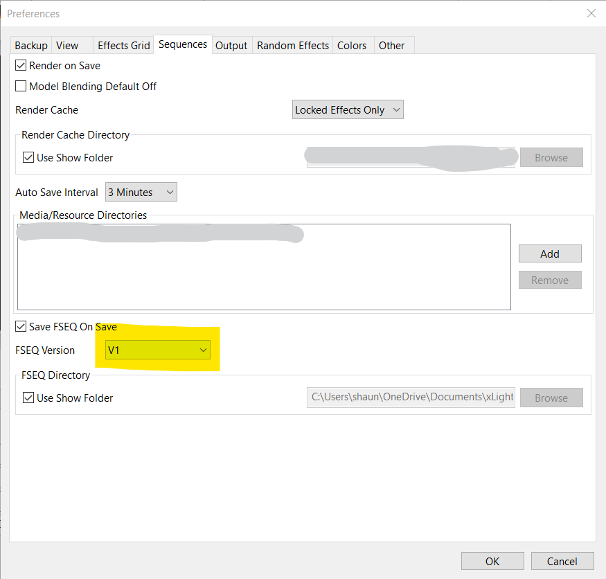

Xlights FSEQ Header Library
===========================
	Name:      FSEQLib.cpp
	Author:    Shaun Price
	Contact:   Via Github
	Copyright: Copyright (C) 2018-2020 Shaun Price

Versions
--------
- 1.0.0 - 24 Sep 2018 - Initial release.
- 1.0.1 - 25 Sep 2018 - Updated the header and example to add ESP8266 support
- 1.0.2 - 25 Sep 2018 - Updated the header to work correctly with C++ Windows Console application.
- 1.1.1 - 10 Nov 2019 - Updated the example to work with the current versions of the ESP8266 libraries that merge the SD and FS libraries into the SdFat library.
- 1.1.2 - 25 Nov 2020 - Updated the example to work with the current versions of the ESP8266 libraries. It apears that the SdFat changes for the ESP8266 reverted back. 
- 2.0.0 - 28 Dec 2020 - Version 2.0.0 release that includes the FSEQ 2.0 file format.

License
-------
This program is free software: you can redistribute it and/or modify
it under the terms of the GNU General Public License as published by
the Free Software Foundation, either version 3 of the License, or
(at your option) any later version.

This program is distributed in the hope that it will be useful,
but WITHOUT ANY WARRANTY; without even the implied warranty of
MERCHANTABILITY or FITNESS FOR A PARTICULAR PURPOSE.  See the
GNU General Public License for more details.

You should have received a copy of the GNU General Public License
along with this program.  If not, see <https://www.gnu.org/licenses/>.

Installing
----------
To install this library:

install it using the Arduino Library manager ("Sketch" -> "Include Library" -> "Manage Libraries..."), or
download a zipfile from Github using the "Download ZIP" button and install it using the IDE ("Sketch" -> "Include Library" -> "Add .ZIP Library..."
clone this git repository into your sketchbook/libraries folder.
For more info, see https://www.arduino.cc/en/Guide/Libraries

Using
-----
You're going to need a couple of things to get started as follows:
- 1 x ESP32 or an ESP8266 board. I used the Wemos Lolin32 Lite (ESP32) and a Wemos D1 R2 mini (ESP8266) but Arduino compatible boards will work as long as they are fast enough.
- 1 x microSD card reader. I've tested is with the [Adafruit MicroSD card breakout board] (https://www.adafruit.com/product/254) and the [Polulu Breakout Board for MicroSD Card](https://www.pololu.com/product/2597).
- 1 x microSD card
- 1 x LED light strip. The example uses a strip of WS2811/WS2812's but the Xlights FSEQ file jus supplies the colour values and is not specific to any lights.
- 1 x FSEQ file. The open source and free [Xlights](https://xlights.org/) program generates these files when it saves sequences. The standard Arduino file does not support long filenames so you'll need to rename it into the 8.3 format. As an example, I renamed my file from single.fseq to  show.dat. Also note that if you wish to play the FSEQ as in the example project you'll either need to ssave the FSEQ file in uncompressed format (V1 or V2 Uncompressed) or implement the decompression function in your code. The version settings for the sequences are set in [File][Preferences] on the Sequences tab as shown below.

Firstly, check that you SPI pin's used to read the data from the SD card are correct. The SD Card VSPI PINS on the Wemos Lolin32 Lite (ESP32) card are as follows:

	SCLK = 18
	MISO = 19
	MOSI = 23
	SS = 5

The SD Card SPI PINS on the Wemos D1R2 mini (ESP8266) card are as follows:

	SCLK = D5/GPIO 14
	MISO = D6/GPIO 12
	MOSI = D7/GPIO 13
	SS   = D8/GPIO 15 
If you're using the card detect pin you'll also need to define it. You may need a 10k pull-up resistor connected to this pin to make sure it goes high. The Card Detect (CD) pin gets pulled to ground when there's no card inserted but it will be floating if there's no pull-up resistor (resistor connected to positive).

Check that you have the correct number of nodes/pixels per strip defined and if you're using universes in hte example make sure they're also defined. The example uses only one universe (output) but can be configured to use more.

Finally, you'll also need to tell the [FastLED](http://fastled.io/), [Adafruit Neopixel](https://github.com/adafruit/Adafruit_NeoPixel) or other library which pin you're using and how many LED's/Nodes/Pixels are on that pin. I've used both the FastLED, Adafruit and sent the data via a second SPI interface to an FPGA. The example uses the FastLED libraries.

Xlights
-------
When setting up you Xlights use a Null Output. Mine is set up for a 240 pixel string. This equates to 720 channels (3 x 240 = 720).

When you've set up your sequece and saved it a file with the extension FSEQ will be saved. Rename this to the 8.3 format if you're not using a filesystem library tha uses long file names (e.g. *this_is_a_long_file_name.fseq* could be renamed to *short.fsq*). The example uses the default FS library with doesn't support lng filenames.

Getting Help on LED lighting and Xlights
----------------------------------------
I recomend:

1. AusChristmas Lighting (https://auschristmaslighting.com/forums/)
2. Adafruit's The Magic of NeoPixels (https://learn.adafruit.com/adafruit-neopixel-uberguide/the-magic-of-neopixels)
3. Xlights/Nutcracker Wiki (http://www.nutcracker123.com/wk/index.php?title=Main_Page)
4. Youtube (https://www.youtube.com)

# Recognition
This project would note be possible without information on the FSEQ file format gained from the following GitHub projects:

[Falcon Christmas](https://github.com/FalconChristmas/fpp) https://github.com/FalconChristmas/fpp

[xLights Project](https://github.com/smeighan/xLights) https://github.com/smeighan/xLights

Notes
-----
If you're a C++ programmer you might have noticed that the library has some compile time directives to see if it's being compiled for Arduino. That's because I also use the library in a Windows command line application for testing that's compiled with Visual Studio. 
